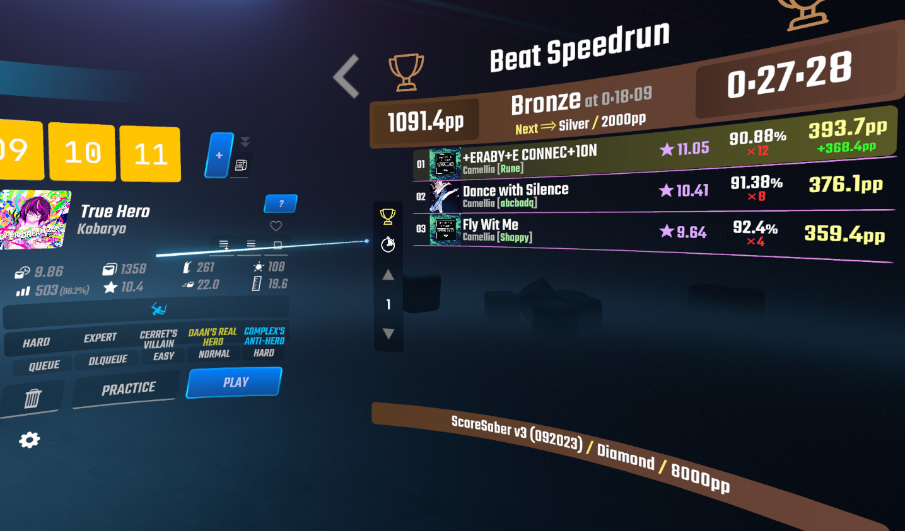
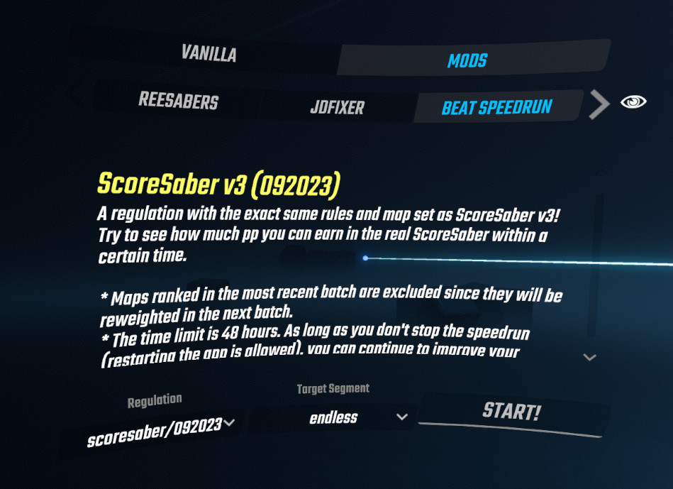
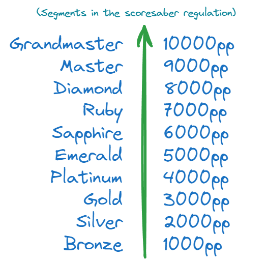
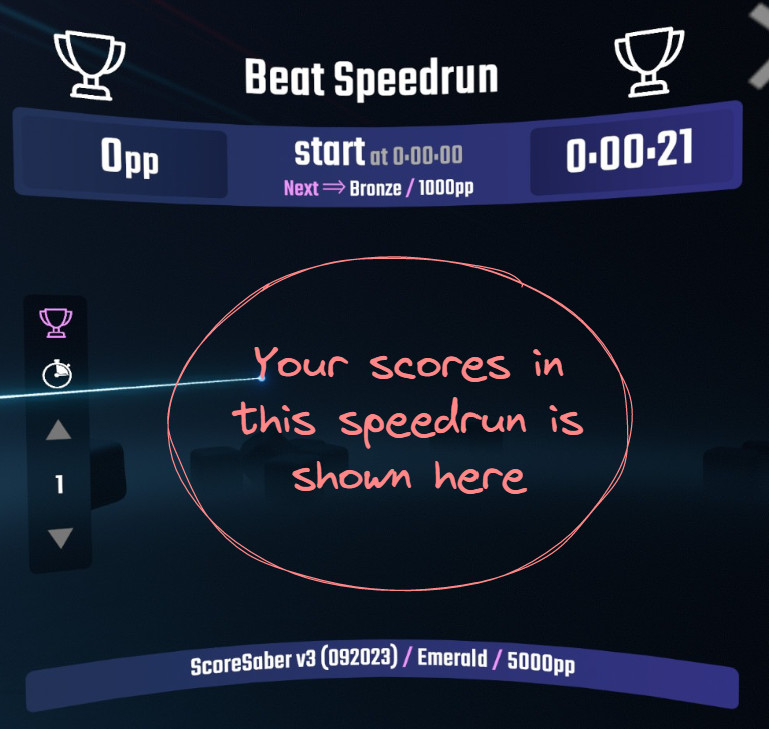

# Beat Speedrun MOD

Beat Speedrun is a Beat Saber MOD that provides Leaderboard UI and score aggregator. Its primary usage is for simulating speedrunning under the scoring system like [ScoreSaber](https://scoresaber.com/), but it can also be used to see the daily play record.

## How to speedrun

### 1. Install this MOD

See [Releases](https://github.com/acc-is-sponge/beat-speedrun-mod/releases) for download link, supported versions, and dependencies.

### 2. Select the regulation ant the target segment on the `BEAT SPEEDRUN` tab

- The **regulation** is a definition consisting of speedrun rules. For example, `scoresaber/[month][year]` would be the exact same mapset and pp curve as ScoreSaber in that year and month.
- The **target segment** determines pp you are aiming for. Each segment has a name to easily distinguish it from regular pp aggregated in the leaderboard system (e.g. ScoreSaber).

### 3. Press `START!`

Your can see your speedrun progress (current pp, time, segment, and top/recent scores) on the leaderboard tab (press `>` to navigate).

Your speedrun will continue even after exiting the app. The timer stops when the target segment is successfully achieved, or the time expires (set at 48 hours in the scoresaber regulation).

## How this works

Beat Speedrun does not communicate with the leaderboard system (e.g. ScoreSaber) at all. It calculates and displays pp based on its own regulations. Regulation definitions are maintained in the [beat-speedrun-regulations](https://github.com/acc-is-sponge/beat-speedrun-regulations) repository and are updated regularly.

In additions to regulations, a set of difficulty rating for each map is defined as a map set. Map set definitions are maintained in the [beat-speedrun-mapsets](https://github.com/acc-is-sponge/beat-speedrun-mapsets) repository, which is also regularly updated.

By default, this MOD fetches the current, up-to-date regulations from these repositories and lists them on the `BEAT SPEEDRUN` tab.

## How to use custom regulations

#### Use custom regulation files

Put your regulation files into `$(BeatSaberDir)/UserData/BeatSpeedrun/CustomRegulations/`

#### Use online custom regulations

Add URIs to `RegulationUris` in `$(BeatSaberDir)/UserData/BeatSpeedrun.json`

## Credits

- Thanks to [FaZPi](https://twitter.com/FaZ_Pi), [hatopop](https://github.com/hatopopvr) for testing!
- Icon by [Freepik](https://www.freepik.com/).
